<div align="center">

<!-- Animated Header with Particle Effect -->


<!-- Animated Title with Multiple Lines -->
<a href="https://git.io/typing-svg">
  
</a>

<!-- Cool Divider -->


<!-- Animated Badges -->
<p>
  
  
  
  
</p>

</div>

<!-- Neon Glow Section -->
<div align="center">
  
```diff
@@                                                                           @@
@@  🎯 Transforming Complex UI/UX Designs into High-Performance Solutions   @@
@@  ⚡ 40% Performance Boost | 85%+ Test Coverage | 14M+ Users Served      @@
@@  🏆 Building Scalable Component Architectures That Stand the Test       @@
@@                                                                           @@
```

</div>


<!-- Main Content with 3D Cards Effect -->
<div align="center">

## 🧬 **DNA OF A FRONTEND ENGINEER** 🧬

</div>

<table align="center">
<tr>
<td width="50%" valign="top">

### 🎨 **CREATIVE TECHNOLOGIST**

```javascript
const owen = {
  title: "Senior Frontend Developer",
  company: "Equity Bank Kenya",
  stack: {
    expert: ["React.js", "Angular", "TypeScript"],
    proficient: ["Node.js", "NestJS", "GraphQL"],
    learning: ["Advanced Patterns", "Micro-Frontends"]
  },
  architecture: {
    components: "Atomic Design",
    state: "Redux | Context API",
    testing: "Jest | RTL (85%+ coverage)"
  },
  achievements: [
    "⚡ 40% faster load times",
    "🎯 60% fewer support queries",
    "🚀 14M+ active users served",
    "📦 50+ reusable components built"
  ]
};
```

</td>
<td width="50%" valign="top">

### 💎 **PERFORMANCE ARCHITECT**

```mermaid
graph TD
    A[🎯 User Experience] -->|Optimize| B[⚡ Performance]
    B -->|Code Splitting| C[📦 40% Smaller Bundles]
    B -->|Lazy Loading| D[🚀 Faster Load Times]
    A -->|Quality| E[🧪 Testing]
    E -->|85% Coverage| F[🛡️ Reliable Code]
    A -->|Scale| G[📈 Component Library]
    G -->|Reusability| H[⏱️ 40% Faster Dev]
```

<div align="center">



</div>

**Impact Metrics:**
- 🎯 **Performance:** 50% Core Web Vitals improvement
- 🧪 **Quality:** 30% reduction in production bugs
- 📚 **Reusability:** 40% faster feature development
- 👥 **UX:** 50% increase in user engagement

</td>
</tr>
</table>

<!-- Tech Stack with Neon Glow -->
<div align="center">


## 🔥 **ARSENAL OF TECHNOLOGIES** 🔥

### **Frontend Mastery**
<p>

</p>

### **Backend & APIs**
<p>

</p>

### **DevOps & Tools**
<p>

</p>

### **Databases & Testing**
<p>

</p>


</div>

<!-- Featured Projects Section -->
<div align="center">

## 🚀 **FLAGSHIP PROJECTS** 🚀

</div>

<table>
<tr>
<td width="50%">

<div align="center">

### 🏦 **Digital Banking Platform**


**Enterprise Banking Solution**

```yaml
Users: 14M+ customers
Impact: 50% ↑ engagement
Performance: 40% ↓ load time
Architecture: Micro-frontend
Coverage: 85%+ tests
```

🎯 Component-based architecture  
⚡ Optimized for scale  
🔒 Bank-grade security  
📱 Fully responsive  

</div>

</td>
<td width="50%">

<div align="center">

### 💳 **Motor Insurance Module**


**Insurance Purchase Flow**

```yaml
Transactions: 10K+ monthly
Forms: Multi-step validation
APIs: REST & GraphQL
Testing: Comprehensive suite
UX: Intuitive interface
```

📋 Complex form handling  
🔄 Real-time validation  
💰 Payment integration  
📊 Analytics dashboard  

</div>

</td>
</tr>

<tr>
<td width="50%">

<div align="center">

### 💰 **PayPal Integration**


**Payment Gateway Solution**

```yaml
Security: Bank-grade encryption
Browsers: Cross-browser tested
Flow: Seamless checkout
Error: Robust handling
Status: Production-ready
```

🔐 Secure transactions  
🌐 Global compatibility  
⚡ Fast processing  
📱 Mobile-optimized  

</div>

</td>
<td width="50%">

<div align="center">

### 📚 **Component Library**


**Design System & Components**

```yaml
Components: 50+ reusable
Dev Time: 40% ↓ faster
Documentation: Full coverage
Testing: Automated suite
Adoption: Organization-wide
```

🎨 Atomic design pattern  
📖 Storybook docs  
♿ Accessibility first  
🔧 Customizable themes  

</div>

</td>
</tr>
</table>

<!-- GitHub Stats with Custom Theme -->
<div align="center">


## 📊 **GITHUB ANALYTICS** 📊

<p>


</p>


<!-- Contribution Graph -->


<!-- Trophy Section -->


</div>

<!-- Experience Timeline -->
<div align="center">

## 🎯 **CAREER JOURNEY** 🎯

```mermaid
timeline
    title Professional Experience Timeline
    2014-2019 : Branch Operations Officer : I&M Bank : Banking Operations & Digital Transformation
    2020-2021 : DevOps Engineer : Safaricom PLC : CI/CD & Infrastructure (99% error detection)
    2021-2021 : Mobile Application Developer : Safaricom PLC : React.js & Fintech APIs (60% ↓ support queries)
    2021-Present : Senior Frontend Developer : Equity Bank : Digital Banking Platform (14M+ users)
```

</div>



<table>
<tr>
<td width="33%" align="center">

### 🏦 **Equity Bank**
**Senior Frontend Developer**  
*Sep 2021 - Present*

- 🚀 14M+ customers served
- ⚡ 40% performance boost
- 🧪 85%+ test coverage
- 📦 50+ components built

</td>
<td width="33%" align="center">

### 📱 **Safaricom PLC**
**Mobile & DevOps Engineer**  
*Dec 2020 - Sep 2021*

- 📲 React.js applications
- 🔧 99% error detection
- 🐳 Docker & Kubernetes
- 📉 60% ↓ support queries

</td>
<td width="33%" align="center">

### 🏛️ **I&M Bank**
**Branch Operations Officer**  
*Jun 2014 - Dec 2019*

- 💼 Banking operations
- 🔐 Compliance & KYC
- 🤝 Digital transformation
- 📊 Process optimization

</td>
</tr>
</table>

<!-- Skills Radar -->
<div align="center">


## 💪 **CORE COMPETENCIES** 💪

<table>
<tr>
<td width="25%" align="center">

**⚛️ React Ecosystem**


Hooks, Context, Redux  
Custom Hooks, HOCs  
Performance Optimization  
Server Components

</td>
<td width="25%" align="center">

**🅰️ Angular Framework**


TypeScript, RxJS  
Lazy Loading, Guards  
NgRx State Management  
Module Architecture

</td>
<td width="25%" align="center">

**⚡ Performance**


Code Splitting (40% ↓)  
Lazy Loading, CDN  
Core Web Vitals (50% ↑)  
Bundle Optimization

</td>
<td width="25%" align="center">

**🧪 Testing & QA**


Jest, RTL (85%+ coverage)  
Integration Testing  
E2E with Cypress  
TDD Methodology

</td>
</tr>
<tr>
<td width="25%" align="center">

**🔌 API Integration**


REST APIs  
GraphQL, Apollo  
WebSockets  
Error Handling

</td>
<td width="25%" align="center">

**🎨 UI/UX Translation**


Figma to Code  
Responsive Design  
Accessibility (WCAG)  
Cross-browser

</td>
<td width="25%" align="center">

**🏗️ Architecture**


Component Libraries  
Atomic Design  
Micro-frontends  
Design Systems

</td>
<td width="25%" align="center">

**🚀 DevOps & CI/CD**


Docker, Kubernetes  
Azure DevOps  
Git Workflows  
Automation

</td>
</tr>
</table>


</div>

<!-- Quote Section -->
<div align="center">

## 💭 **PHILOSOPHY** 💭

<table>
<tr>
<td align="center" width="33%">

### 🎯
**"First, solve the problem.  
Then, write the code."**  
*- John Johnson*

</td>
<td align="center" width="34%">

### ⚡
**"Premature optimization  
is the root of all evil."**  
*- Donald Knuth*

</td>
<td align="center" width="33%">

### 🚀
**"Make it work,  
make it right,  
make it fast."**  
*- Kent Beck*

</td>
</tr>
</table>

</div>

<!-- Connect Section with Animated Buttons -->
<div align="center">


## 🤝 **LET'S BUILD SOMETHING AMAZING TOGETHER** 🤝

<p>
<a href="mailto:otienoowenkelvin@gmail.com">
  
</a>
<a href="tel:+254712692310">
  
</a>
</p>

<p>
<a href="https://linkedin.com/in/owen-kelvin-6101a0125">
  
</a>
<a href="https://github.com/yourusername">
  
</a>
<a href="https://twitter.com/yourusername">
  
</a>
</p>

### 💬 **Open to discuss:**
React • Angular • Performance • FinTech • Component Architecture • CI/CD


</div>

<!-- Visitors Counter -->
<div align="center">

### 👀 Profile Views


</div>

<!-- Snake Animation -->
<div align="center">

<picture>
  <source media="(prefers-color-scheme: dark)" srcset="https://raw.githubusercontent.com/yourusername/yourusername/output/github-contribution-grid-snake-dark.svg">
  <source media="(prefers-color-scheme: light)" srcset="https://raw.githubusercontent.com/yourusername/yourusername/output/github-contribution-grid-snake.svg">
  
</picture>

</div>

<!-- Closing Section -->
<div align="center">


### ⭐ **Star my repositories if you find them useful!** ⭐


</div>
